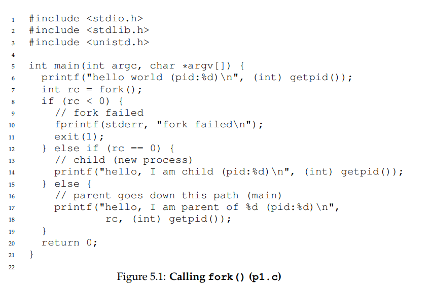

# 计算机操作系统

## 内核函数

### fork

> * fork函数返回0 标识当前代码在子进程中执行  大于0标识当前代码在父进程中执行
> * fork()函数创建的子进程是父进程的完全副本，包括所有的内存、寄存器和文件描述符等。因此，父进程和子进程之间的通信需要使用IPC机制，比如管道、共享内存等。

### exec

> exec有很多相关的命令，大多都是与e,l,p,v关联
>
> * e 的意思是要设置环境变量
> * l 的意思是一个一个参数传，不能用列表
> * p 的意思是不用设置环境变量了，直接在PATH环境中搜索，我的理解就是系统环境变量
> * v 的意思是参数使用列表传递 vector

### wait

> wait函数的返回值是 子进程的pid和终止状态
>
> * 0正常结束
> * -1 异常

### waitpid

> 第一个参数
>
> * 大于0 则等待具体进程结束
> * 小于0 则等待所有子
