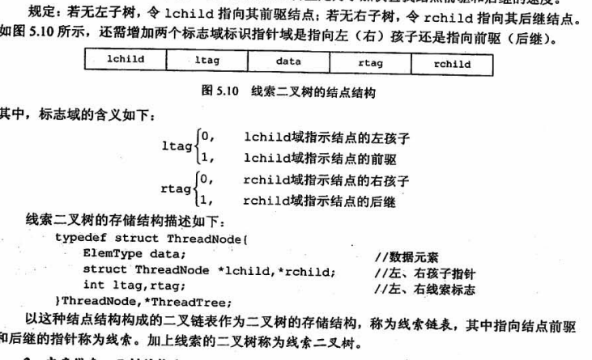

# 数据结构与算法
## 栈和队列
### 栈
**栈的数学性质**:n个不同元素进栈，出栈元素不同排列的个数为$\frac{1}{n+1}C^{n}_{2n}$，称为卡特兰数
**共享栈**:两个顺序栈共享一个数组，数组的两端为栈底，可以节省空间

### 队列

### 栈和队列的应用
1. 用栈去消扩号，对称
2. 用栈实现表达式，计算结果，坚持一个原则：数字顺序不可变，符号按要求放，然后当作整体继续
    * 前缀表达式: 符号在数字前面  **波兰表达式**    中转前 右优先   前缀运算先弹的是左操作数
    * 中缀表达式: 常见的顺序 
    * 后缀表达式: 符号在数字后面  **逆波兰表达式**  中转后 左优先 弹出优先级高于或等于当前运算符的所有运算符 遇到左括号直接入栈，遇到右括号依次弹出加入后缀表达式直到左括号为止    后缀运算先弹栈的是右操作数
3. 递归，但是递归效率低（因为有很多重复计算），有溢出风险，但是代码简单。有递归函数。边界条件。主要看能不能不改变条件把数据变成规模更小的运算
4. 树的层次遍历需要用到队列，在第一个节点的时候需要保存下一层的节点
   
### 矩阵的压缩
**行优先**:存一行，再存下一行
**列优先**存一列，在存下一列

1. 对称矩阵  方的，沿着从左上到右下的对角线对称
2. 三角矩阵  只有一半矩阵有数据，其他的都是常量 存储方法和对角矩阵查不到 常量存最后
3. 三对角矩阵  带状矩阵  除了第一行两个最后一行两个 其他行三个，剩余位置都是0
4. 稀疏矩阵   少数位置有元素其他都是0    存个三元组 存i,j和值    十字链表法

## 线索二叉树

1. 线索二叉树数据结构  左右孩子不变，多个两个标识位，用来标识孩子是线索还是节点

