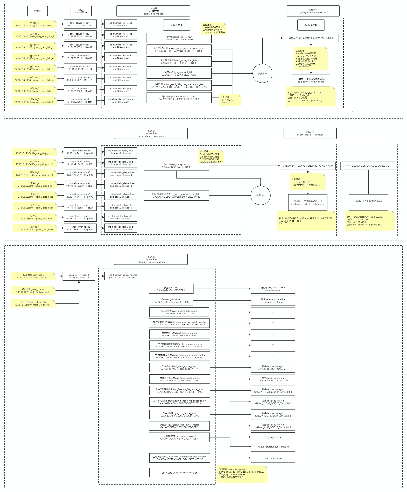
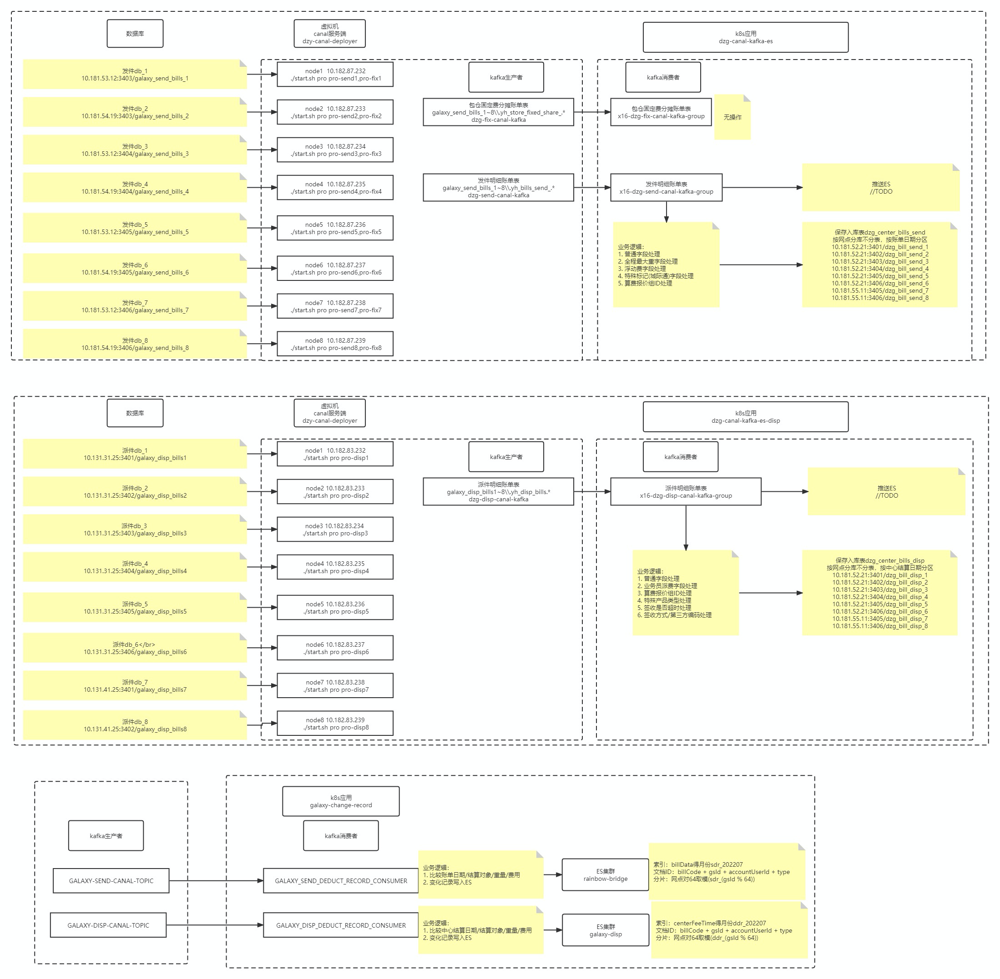

### 网点分拨大区匹配取数据
**sql导数平台**
http://dbtool.yundasys.com:8066/

### 网点分拨大区匹配取数据
```sql
  -- 一级公司-对口城市-财务分拨-业务省-大区关系表
SELECT 
t1.sjdw as bm, -- 取上级网点
y.mc as mc,-- 上级网点名称
CASE WHEN t2.regionCode is null then '0' ELSE t2.regionCode END as region_bm, -- 对口城市编码
CASE WHEN t2.regionName is null then  '0' ELSE t2.regionName END as region_mc,-- 对口城市编码
CASE WHEN t3.zzz is null then '0' ELSE t3.zzz END as fb_bm, -- 分拨编码
CASE WHEN t4.mc is null then '0' ELSE t4.mc END as fb_mc, -- 分拨名称
CASE WHEN j.package_short is null then t4.mc ELSE j.package_short END as fb_mc, -- 分拨简称
CASE WHEN t5.ProvinceID_b is null then '0' ELSE t5.ProvinceID_b END as province_bm,
CASE WHEN t6.ProvinceName_b  is null then '0' ELSE  t6.ProvinceName_b END as province_mc,-- 省份名称
CASE WHEN t6.short_name is null then '0' ELSE  t6.short_name END as province_short_mc, -- 省份简称
t6.Provincerank_b,-- 省份顺序
t7.rg_id as bigarea_id,
t8.rg_name as bigarea_mc
from ydserver.gs t1 
	  left  join  ydserver.region_statements t2 on t1.sjdw=t2.branchCode
	  inner join  ydserver.wdzzz_cw t3 on t1.sjdw=t3.wdbm 
      inner JOIN  ydserver.gs t4 ON t3.zzz = t4.bm and t4.lb = 3   
      LEFT JOIN  ydserver.county t5 ON t4.szd = t5.CountyID
	  left join  ydserver.gsjcb j on t3.zzz=j.gs
      LEFT JOIN  ydserver.province_business t6 ON t5.ProvinceID_b = t6.ProvinceID_b
      LEFT JOIN  ydserver.province t7 ON t7.ProvinceID = t6.ProvinceID
      LEFT JOIN  ydserver.tb_region t8 ON t8.rg_id = t7.rg_id
	  left join  ydserver.gs y on t1.sjdw = y.bm
     GROUP BY 1,2,3,4,5,6,7,8,9,10,11,12,13;
```

### 刷课的js
```js
// 自动点击人机验证，自动点击播放下一节
setInterval(function () {
  var btn = $(".layui-layer-dialog > .layui-layer-btn > .layui-layer-btn0");
  if (btn.length) {
    btn.click();
    console.log('点击"继续学习"');
  } else {
    console.log('未找到 "继续学习" 按钮');
  }
}, 5000);

foot.player.addListener("ended", function () {
  var curLearning = $(".learning.current");
  if (curLearning.length) {
    console.log(curLearning.find("a")[0].innerText + "播放完了");
  }

  setTimeout(function () {
    var nextLi = curLearning.next();
    if (nextLi.length) {
      var next = nextLi.find("a");
      if (next.length) {
        var name = next[0].innerText;
        next.click();
        console.log("点击 播放下一节：" + name);
        console.log("等待网络请求, 5秒后点击 播放");
        setTimeout(function () {
          foot.player.playOrPause();
          console.log("点击 播放按钮");
        }, 5000);
      }
    } else {
      console.log("没有找到下一节，你可能已经全部学完了");
    }
  }, 1000);
});
```
### 数据库和canal关系图




