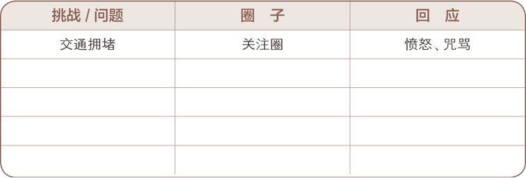

> 要认识到人的看法是基于自己的 ***思维模式*** 产生的，但是自己的思维模式是基于自己的成长经历和文化背景产生的，未必正确，未必全面，所以重要的是要先带入和自己不一样的人的视角，从他的角度和思维模式去看他说的是否正确。

- [1. 积极主动--个人愿景的原则](#1-积极主动--个人愿景的原则)
- [2. 以始为终--自我领导的原则](#2-以始为终--自我领导的原则)
- [3. 人际关系的本质](#3-人际关系的本质)
- [4. 双赢思维--领导力的原则](#4-双赢思维--领导力的原则)
- [5. 知彼知己--移情沟通的原则](#5-知彼知己--移情沟通的原则)
- [6. 统合综效--创造性合作的原则](#6-统合综效--创造性合作的原则)
- [7. 不断更新--平衡的自我提升原则](#7-不断更新--平衡的自我提升原则)
# 1. 积极主动--个人愿景的原则
> **积极主动**不仅指行事的态度，还意味着人一定要对自己的人生负责。个人行为取决于自身的抉择，而不是外在的环境，人类应该有营造有利的外在环境的积极性和责任感。

我的感觉是，要积极为自己的目标积极的采取措施，比如你想睡觉，就把窗帘关上，保持安静，保持身体舒适，没有环境尽可能的去创造环境。学习的时候，容易分心，就把桌面收拾的干干静静，减少一切干扰因素。而不是说环境怎样，我就怎样。尽可能的去创造环境。

>因此，伤害我们的并非悲惨遭遇本身，而是我们对于悲惨遭遇的回应。尽管这些事的确会让人身心受创或者经济受损，但是品德和本性完全可以不受影响。事实上越痛苦的经历，越能磨炼意志，开发潜能，提升自如应对困境的能力，甚至还可能感召他人争取同样的自由。

>积极主动的人虽然更看重自己的影响力，但他们的关注圈往往不小于影响圈，这样才能有效发挥影响力。

关注那些我们能影响的东西，采取积极行动，而不是把太多的精力放在关注我们无法影响的东西上，但是无法影响的东西也要适当关注，因为那个有利于我们的判断和引导我们的方向
> 1. **可直接控制的问题**：可以通过培养正确习惯来解决.*第二部分“个人领域的成功”中讨论到的习惯一、二、三即属于这一类*
> 2. **可间接控制的问题**：可以通过改进施加影响的方法来解决，例如采取移情方式而不是针锋相对，以身作则而不是口头游说。*这在第三部分“公众领域的成功”的习惯四、五、六中有所论述。*
> 3. **无法控制的问题**：我们要做的就是改变面部曲线，以微笑、真诚与平和来接受现实。纵使有再多不满，也要学着泰然处之，这样才不至于被问题左右。

改变我们能改变的，坦然接受不能改变的。**因上努力果上随缘**。
>自我意识是另外三种天赋的催化剂。只有能够有意识脱离自我，并且审视它，仔细思考你的想法、感觉和情绪，才能有基础用全新的方法去使用想象力、良知和独立意志。你才能真正超脱。你超脱了自己的背景、过去、心理负担，就像我的朋友做到的那样。

和弗洛伊德的超我差不多，我理解下来就是能够超脱出自己，以第三者的视角审视自己的一切。

>想想过去几周内自己以消极方式做出回应的两三件事情。描述一下自己是怎么说的。
>1. 
>2. 
>3. 

>现在，想想在同样情况下自己可以采取的几种积极的回应。请写在下面。
>1. 
>2. 
>3. 

上面的方法不错，在有自己的目标的时候，想做的事情，就采取积极主动的心态去做。
# 2. 以始为终--自我领导的原则
>“以终为始”的一个原则基础是“任何事都是两次创造而成”。我们做任何事都是先在头脑中构思，即智力上的或第一次的创造（Mental/First Creation），然后付诸实践，即体力上的或第二次的创造（Physical/Second Creation）。

这个是我大受震撼,我以前没有那么明确的感受过，任何事情都要分两段，我思考的比较好，但是付诸实践的时候不太行。
人生能做到的不是写剧本，正如艾比荷泰徳所说，我们登上并非我们所选择的舞台，演出并非我们所选择的剧本，但是我们是可以改写剧本的。
如何改写剧本，我们的生活要以原则为中心，而不是以此外的任何东西，

# 3. 人际关系的本质
>牢记一点：速战速决是不切实际的，建立和维护关系都需要时间。如果因为他反应冷淡或者不以为然就不耐烦起来，那就是前功尽弃。千万不要这样去指责他：“我们为你做了那么多，牺牲了那么多，你怎么这么没良心？我们想要做得好一点，你这叫什么态度？真是太不像话了！”
# 4. 双赢思维--领导力的原则
不能双赢，就好聚好散。亲人除外
# 5. 知彼知己--移情沟通的原则
>我们在听别人讲话时总是会联系我们自己的经历，因此自以为是的人往往会有四种“自传式回应”（Autobiographical Response）的倾向：
>* 价值判断——对旁人的意见只有接受或不接受。
>* 追根究底——依自己的价值观探查别人的隐私。
>* 好为人师——以自己的经验提供忠告。
>* 自以为是——根据自己的行为与动机衡量别人的行为与动机。
我一直以为自己是个很好的倾听者，但是我现在看来自己总是容易犯以上的问题，还自以为自己很耐心的倾听了。
# 6. 统合综效--创造性合作的原则
> 变得统合综效统合综效不是碰巧发生。你需要自己达到这个状态。如果你还不确定要从哪开始，按照下面这个简单的五步计划进行：
> 1. 定义问题或机会。
> 2. 他们的方式（首先试着理解别人的想法）。
> 3. 我的方式（试着通过分享获得理解）。
> 4. 头脑风暴（创造新的机遇和想法）。
> 5. 快速通道（找到最佳解决方案）。

在有冲突的时候，可以采取开放式的方法，取讨论出最佳的解决方案
# 7. 不断更新--平衡的自我提升原则
